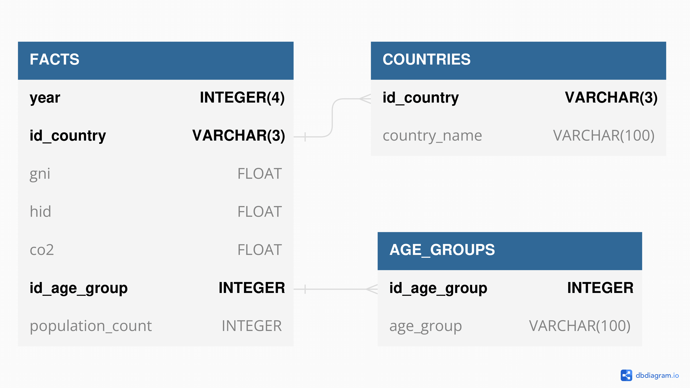

# Projet de base de données évoluées

## Description :

Ce projet rentre dans le cadre du cours de Bases de données évoluées (X2I1010).
Nous avons réalisé un entrepôt de données dans l'objectif de manipuler des requêtes OLAP et de mettre en oeuvre nos compétences acquises durant ce cours. L'entrepôt de données contient les émissions de CO2 dans le monde en comparaison avec le RNB/GNI et l’IDH pour chaque pays.

## Fonctionnalités :

- [Scripts Python pour l'agrégation des jeux de données et la génération d'insertions SQL](scripts)
- [Nos 10 requêtes](requests)
  - [Les résultats bruts](requests/raw_results)
  - [Les résultats sous format CSV](requests/csv_results)
  - [Les visualisations](requests/visualisations)
- [Contrôle d'accès avec 2 VPD (Posgresql)](sql_files/postgresql/SETUP_POLICIES.sql)

## Modèle de données :

Nous avons utilisé 2 jeux de données pour la création de cet entrepôt de données. Les informations détaillées sont retrouvables dans le dossier [src](src). Les données sont organisées dans un schéma en étoile, comme dans l'illustration suivante :

## Contributeurs :

4 contributeurs pour ce projet :
* GOMES DOS REIS Quentin
* LECRIVAIN Matthéo
* MEUNIER Rodrigue
* POUPLIN Gabriel

## Licence :

Le dataset est publié sous la licence [CC-BY 3.0 IGO](https://creativecommons.org/licenses/by/3.0/igo/). Voir le fichier [README](src/README.md) des sources du projet pour le détail des licences des datasets utilisés.