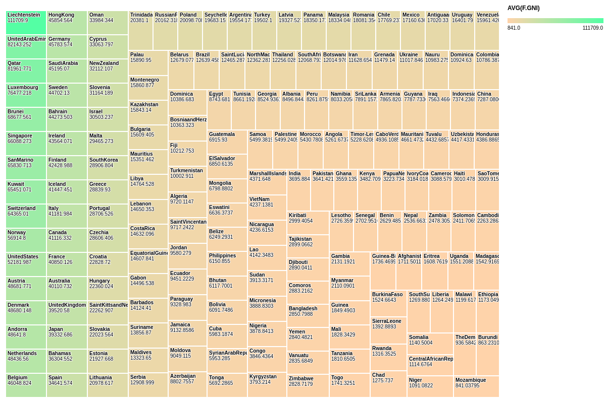
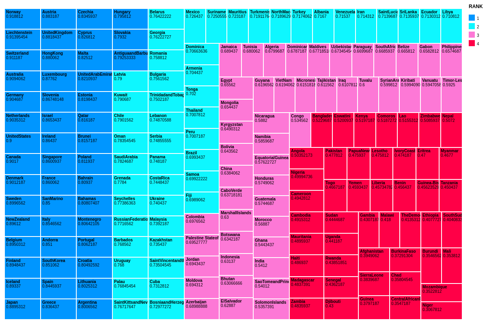
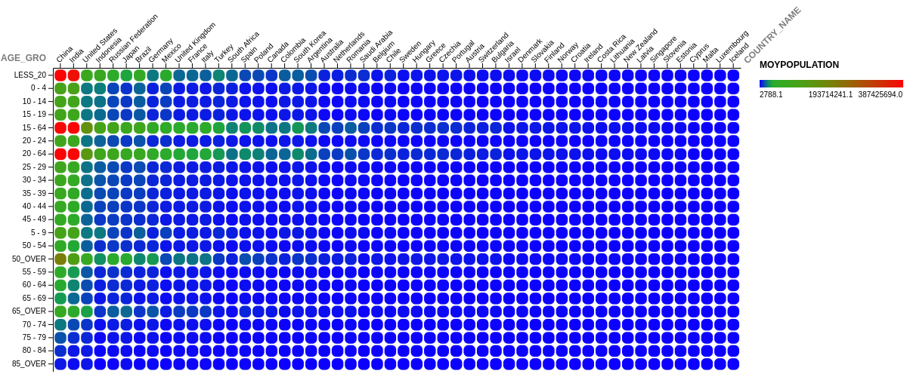
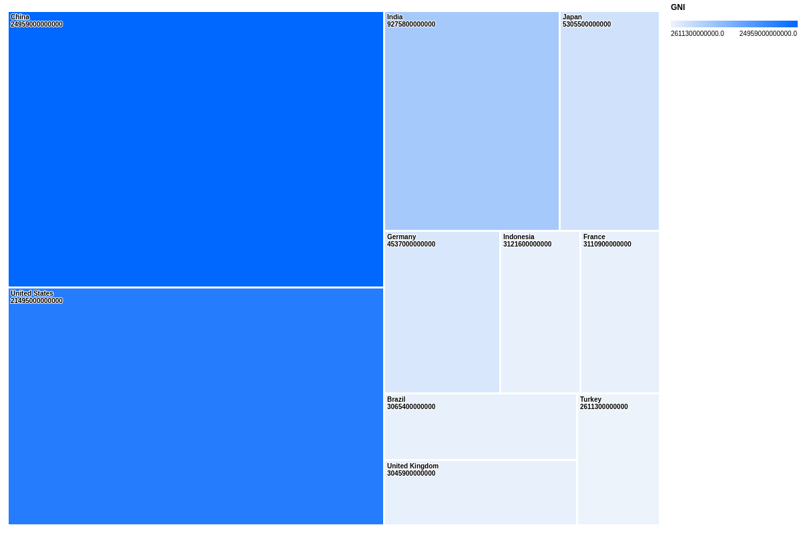
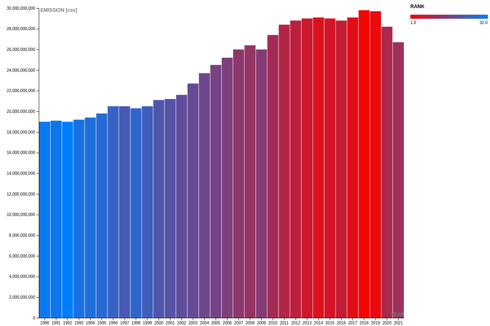

# Visualisations des requêtes

### Requête 2 :

### Requête 4 :

### Requête 5 :

### Requête 6 :

### Requête 7 :

### Requête 8 :

### Requête 9 :

### Requête 10 :

## Crédits
Ces visualisations ont été réalisées avec [RAWGraphs 2.0 beta](https://app.rawgraphs.io/).