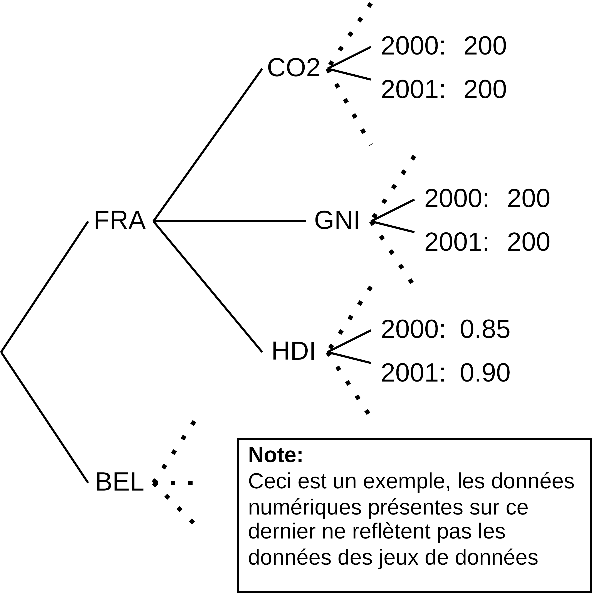
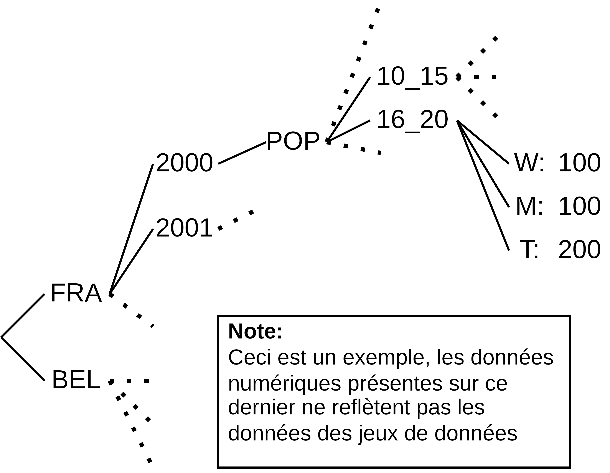
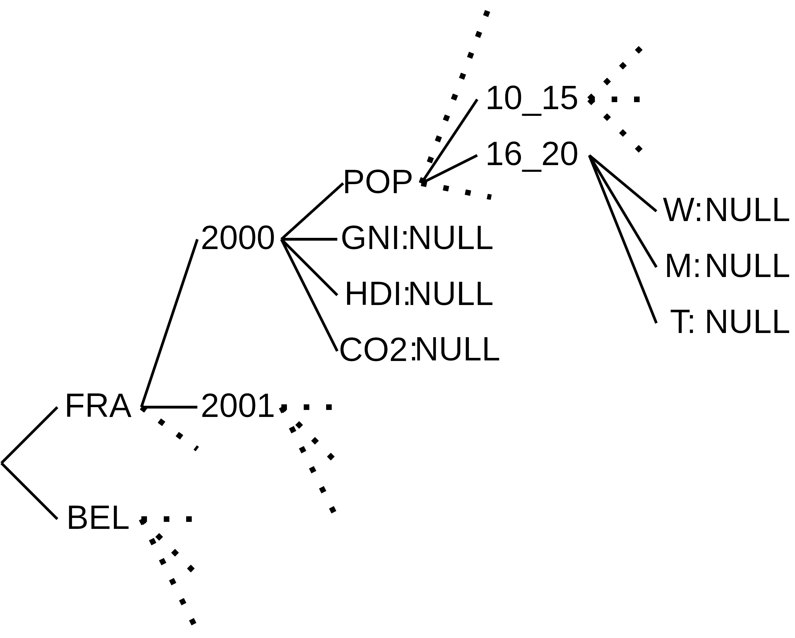
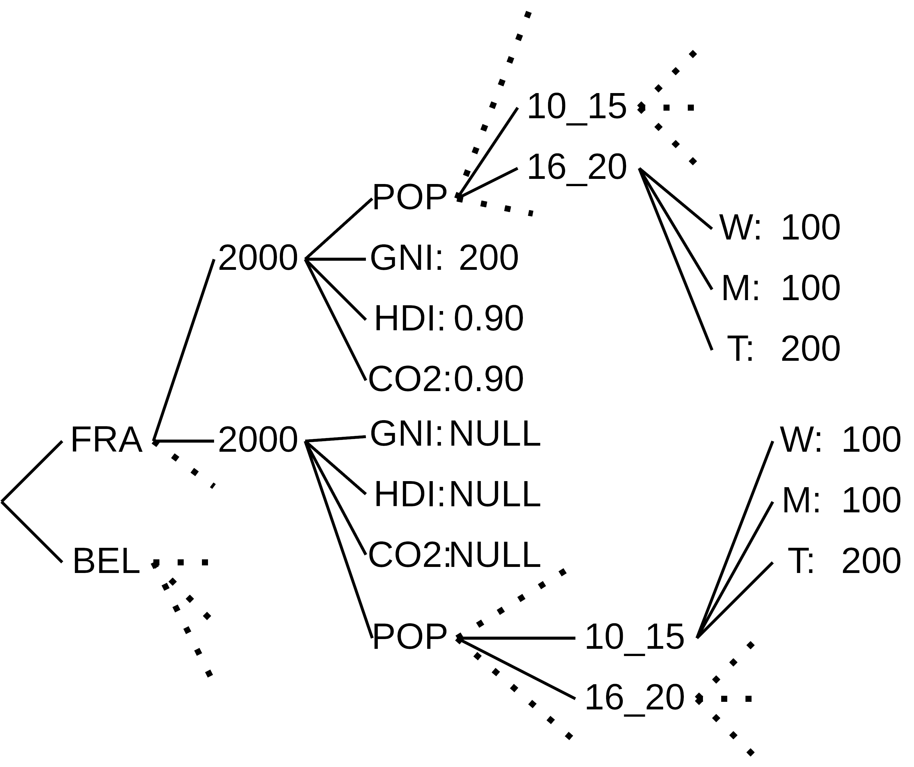
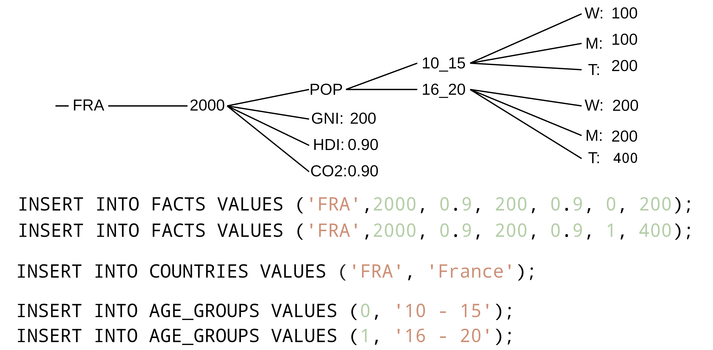

# Convertion et agrégation des données :

Afin de créer notre entrepôt de données, nous avons dû convertir chaque CSV provenant de nos deux jeux de données en un ou plusieurs fichiers SQL contenant des insertions. Pour cela, nous avons utilisé le script Python [convert_everything.py](convert_everything.py). Ce script prend en paramètre les chemins vers chacun des deux fichiers CSV de nos jeux de données et le chemin vers le répertoire qui contiendra les fichiers SQL produits en sortie.

## Comment l'exécuter ?

Pour regénérer des fichiers SQL à partir des CSV, il suffit d'entrer la commande:
```bash
python3 scripts/sql_conversion/convert_everything.py [FICHIER_CSV_POPULATIONS] [FICHIER_CSV_HDI_GNI_CO2] [REPERTOIRE_CIBLE_SQL] [NOMBRE_MAX_PAR_FICHIER_SQL]
```
Ou dans notre cas:
```bash
python3 scripts/sql_conversion/convert_everything.py ./src/POP_FIVE_HIST_13032023185442226.csv ./src/Human\ Development\ Index\ -\ Full.csv ./sql_files  100000
```

## Comment le script fonctionne-t-il ?

Le script commence par lire les deux fichiers CSV et les convertir en arbres de données en mémoire Python, chaque jeu de données aura un arbre de données différent.

> **Note:** Le terme d'arbre de données est utilisé pour désigner une structure de données qui contient des données et des références vers d'autres structures de données, il est utilisé pour désigner l'agencement des données en mémoire lors de l'exécution du script.
Il n'est absolument pas utilisé décrire la structure des fichiers CSV qui est une simple liste de lignes, le script ne fait que réagencer les données à la manière de la structure d'un fichier XML en mémoire.

* Exemple d'arbre de données pour le jeu de données Kaggle :


* Exemple d'arbre de données pour le jeu de données OECD :


Ensuite, le script va créer un arbre de données vierges contenant des valeurs nulles en prenant en entrée l'ensemble des pays et des années traités par les jeux de données ainsi que l'ensemble des groupes d'âge traités par le jeu de données de l'OECD, on obtient ainsi l'arbre suivant :

* Exemple d'arbre de données vierge :


Une fois, cet arbre obtenu, le script va compléter cet arbre avec les deux précédents arbres de données, on obtient ainsi un arbre complet qui contient toutes les données des deux jeux de données, il peut contenir des valeurs nulles si les données étaient absentes sur un des jeux de données pour un pays et une année donnée.

* Exemple d'arbre de données pour complété :

    > **Note:** L'arbre de données présenté ci-dessus n'est pas représentatif des deux premiers arbres présentés pour les deux jeux de données. Ici, on cherche à montrer la présence de valeurs nulles ici pour la France, en 2000, nous n'avons pas de données pour le RSN, l'IDH et le CO².

Maintenant que cet arbre est complet, le script va parcourir cet arbre et générer un fichier SQL par table de notre modèle de données, chaque fichier SQL contiendra les insertions SQL pour remplir la table correspondante, comme dans l'exemple suivant :

* Exemple de génération de SQL avec l'arbre de données : :


Le script va donc générer trois types de fichiers SQL :
* Un fichier SQL pour la table `COUNTRIES` contenant les insertions SQL pour remplir la table `COUNTRies` avec les données de l'arbre de données.
* Un fichier SQL pour la table `AGE_GROUPS` contenant les insertions SQL pour remplir la table `AGE_GROUPS` avec les données de l'arbre de données.
* Un fichier SQL pour la table `FACTS` contenant les insertions SQL pour remplir la table `FACTS` avec les données de l'arbre de données, il y en résultera un tuple par pays, par année et par tranche d'âge.

## Crédits
Les différents schémas ont été réalisées avec [diagrams.net](https://app.diagrams.net/).

