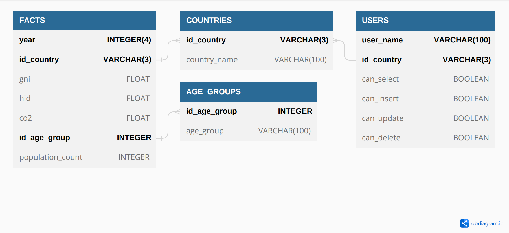

# Création de notre entrepôt de données :

Afin de créer notre entrepôt de données, nous avons utilisé le langage SQL. Nous avons commencé par utiliser Oracle mais nous avons rencontré des problèmes liés à la configuration trop restrictive de l'instance hébergée sur les serveurs de Nantes Université.\

Pour effectuer nos requêtes, nous avons dû installer Oracle XE sur Windows afin de les exécuter sur l'intégralité de nos données.

Oracle XE 21c ne supportant pas les Virtual Private Database, nous avons essayé en vain de les déployer sur l'instance de l'Université avec des données partielles.\

Ne pouvant pas utiliser Oracle, nous avons décidé de passer notre entrepôt de données sous PostgreSQL avec Docker afin d'avoir des VPD *(Appelée ROW SECURITY sous PostgreSQL)* fonctionnelle. 

## Pour reproduire notre entrepôt de données :

### Sous Oracle (Sans les VPD) :
* Prérequis :
    * Oracle® XE 21c\
    ou
    * Oracle® Database 11g

* Exécution des fichiers SQL :
    * [oracle/CREATE_TABLES.sql](oracle/CREATE_TABLES.sql)
    * [INS_AGE_GROUPS_DATA_0.sql](INS_AGE_GROUPS_DATA_0.sql)
    * [INS_COUNTRIES_DATA_0.sql](INS_COUNTRIES_DATA_0.sql)
    * [INS_FACTS_DATA_0.sql](INS_FACTS_DATA_0.sql)
    * [INS_FACTS_DATA_1.sql](INS_FACTS_DATA_1.sql)
    * [INS_FACTS_DATA_2.sql](INS_FACTS_DATA_2.sql)
    * [INS_FACTS_DATA_3.sql](INS_FACTS_DATA_3.sql)

### Sous PostgreSQL (Avec les VPD) :
* Prérequis :
    * PostgreSQL® 15.2

* Exécution des fichiers SQL :
    * [postgresql/CREATE_DATABASE.sql](postgresql/CREATE_DATABASE.sql)
    * [postgresql/CREATE_TABLES.sql](postgresql/CREATE_TABLES.sql)
    * [INS_AGE_GROUPS_DATA_0.sql](INS_AGE_GROUPS_DATA_0.sql)
    * [INS_COUNTRIES_DATA_0.sql](INS_COUNTRIES_DATA_0.sql)
    * [INS_FACTS_DATA_0.sql](INS_FACTS_DATA_0.sql)
    * [INS_FACTS_DATA_1.sql](INS_FACTS_DATA_1.sql)
    * [INS_FACTS_DATA_2.sql](INS_FACTS_DATA_2.sql)
    * [INS_FACTS_DATA_3.sql](INS_FACTS_DATA_3.sql)
    * [postgresql/SETUP_POLICIES.sql](postgresql/SETUP_POLICIES.sql)

## Les VPD ou ROW POLICIES sous PostgreSQL :

Comme évoqué précédemment, nous sommes passés d'Oracle à PostgreSQL pour notre entrepôt de données suite à difficultés pour le déploiement des VPD sous Oracle.\
Dans notre cas, nous avons trouvé intéressant de déployer des ROW POLICIES sur deux tables de notre entrepôt de données à savoir USERS (décrite plus tard) et FACTS. Par la suite, nous considérerons un utilisateur lambda comme un utilisateur possédant le rôle DB_USERS.

### La ROW POLICIES de la table USERS :

* La table USERS :

    

* Ce que fait la ROW POLICY :

    Ici, notre ROW POLICY devra limiter la visibilité des tuples de la table aux utilisateurs. C'est-à-dire, qu'un utilisateur lambda ne pourra retrouver que les tuples le concernant, seul l'administrateur de la base de données pourra lister et modifier l'intégralité des tuples de la table USERS.

### Les ROW POLICIES de la table FACTS :

* Ce que font nos ROW POLICY :

    Sur notre table FACTS, nos ROW POLICY devront limiter les actions (SELECT, INSERT, DELETE et UPDATE) effectuables par les utilisateurs lambda sur  les tuples de la table FACTS.

    La première condition de la réalisation d'une action sur la table FACTS est que l'utilisateur soit lié avec le pays de l'action demandé dans la table USERS.\

    La seconde condition est que cet utilisateur ait le droit de faire l'action demandée sur le tuple de la table FACTS. Cette notion de droit est décrite par les attributs *can_select, can_insert, can_update et can_delete* de la table USERS.\

    Si les deux conditions sont respectées alors l'action sera réalisée, sinon elle sera ignorée.